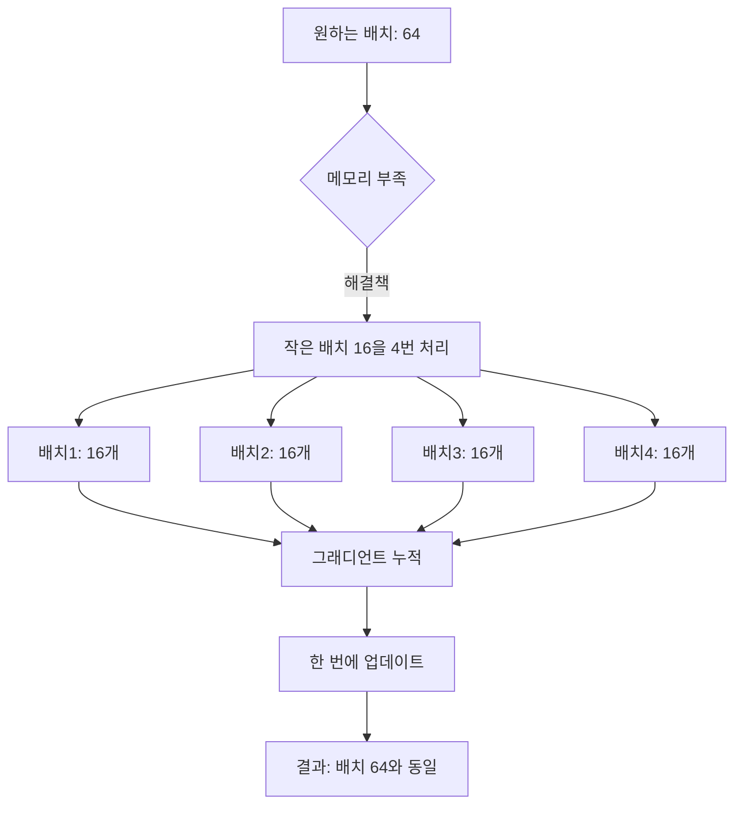
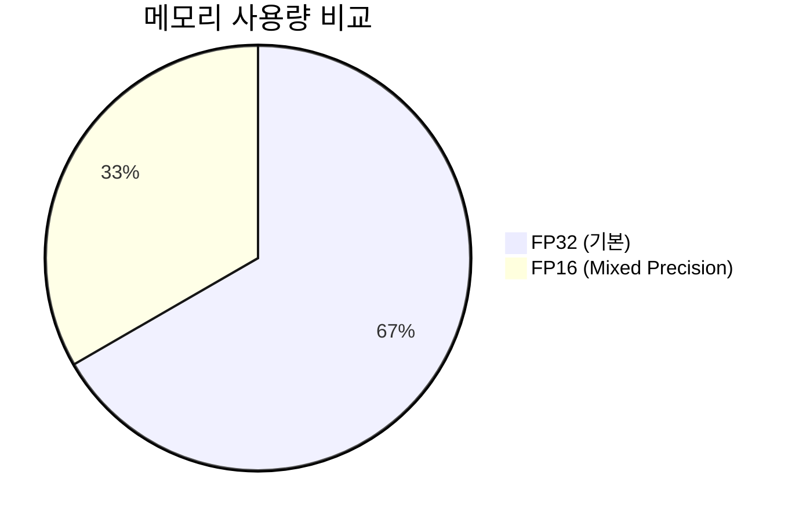
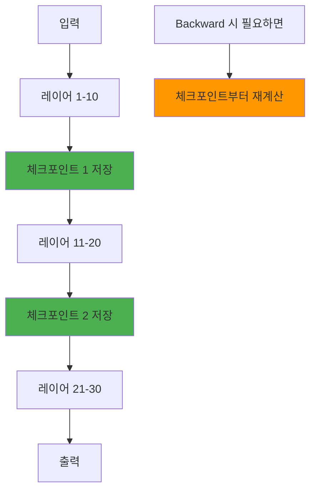
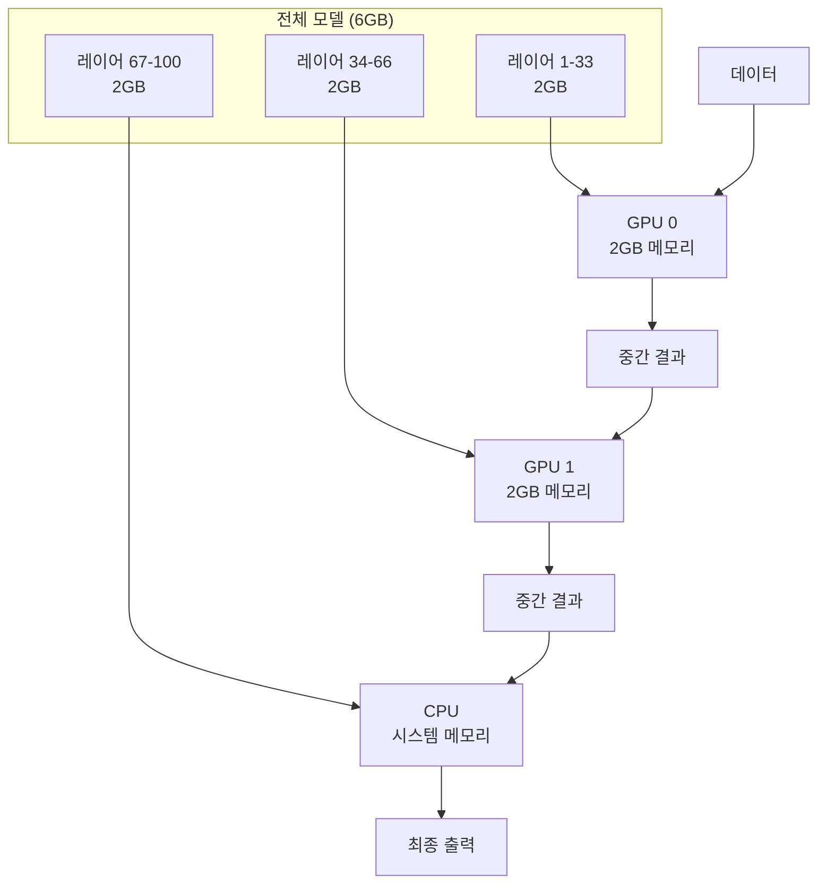
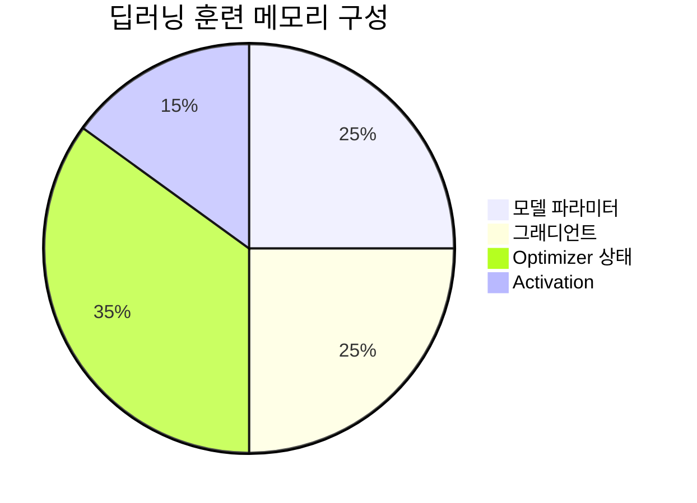
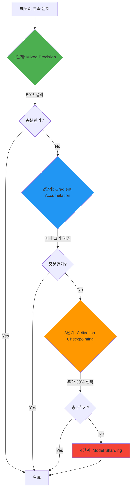
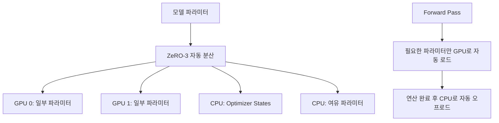
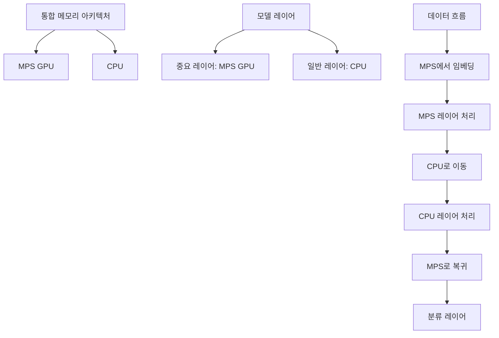
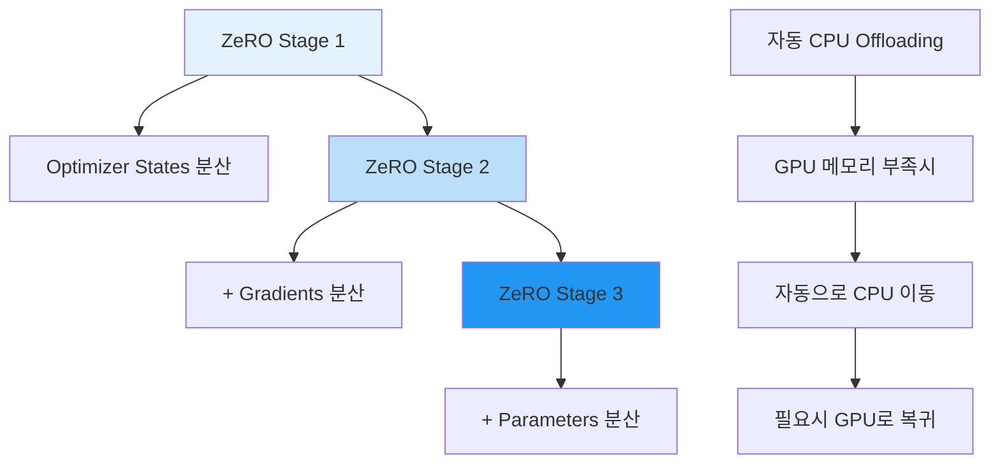
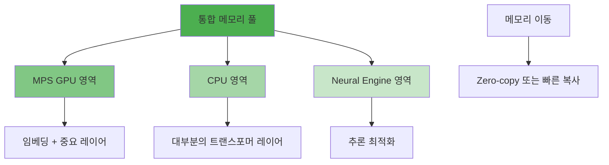

## 1. Gradient Accumulation (그래디언트 누적)

### 🤔 문제상황

큰 배치 크기(예: 64)로 훈련하고 싶지만 GPU 메모리가 부족해서 작은 배치(예: 16)만 가능한 상황

### 💡 핵심 아이디어

작은 배치를 여러 번 처리해서 큰 배치 효과를 내는 방법. "분할 결제"와 같은 개념입니다.



### 🔧 핵심 코드만

```python
# 핵심 구현
accumulation_steps = 4
optimizer.zero_grad()

for i in range(accumulation_steps):
    mini_batch = get_mini_batch(size=16)
    loss = model(mini_batch)
    loss = loss / accumulation_steps  # 평균을 위해 나누기
    loss.backward()  # 그래디언트 누적

optimizer.step()  # 한 번에 업데이트
```

### ⚖️ 효과

- 메모리: 작은 배치 크기 유지
- 학습 효과: 큰 배치와 동일
- 시간: 약간 더 걸림 (여러 번 forward pass)

---

## 2. Mixed Precision Training (혼합 정밀도 훈련)

### 🤔 문제상황

모든 연산을 32비트(float32)로 하면 메모리 사용량이 너무 큼

### 💡 핵심 아이디어

16비트와 32비트를 적절히 섞어서 사용. "압축 파일"과 같은 개념으로 메모리 절반 절약.


### 🔧 핵심 코드만

```python
# 자동 mixed precision
scaler = torch.cuda.amp.GradScaler()

# Forward pass: 16비트 자동 적용
with torch.autocast(device_type='cuda', dtype=torch.float16):
    outputs = model(inputs)
    loss = criterion(outputs, targets)

# Backward pass: 스케일링된 그래디언트
scaler.scale(loss).backward()
scaler.step(optimizer)
scaler.update()
```

### 📊 메모리 절약 효과



---

## 3. Activation Checkpointing (활성화 체크포인트)

### 🤔 문제상황

딥러닝 모델의 각 레이어 출력(activation)을 모두 저장하면 메모리가 부족함

### 💡 핵심 아이디어

일부 activation만 저장하고, 나머지는 필요할 때 재계산. "메모리 vs 계산시간" 트레이드오프



### 🔧 핵심 코드만

```python
from torch.utils.checkpoint import checkpoint

# 체크포인트 적용
def forward(self, x):
    # 이 부분은 activation을 저장하지 않음
    x = checkpoint(self.layer_block_1, x)
    x = checkpoint(self.layer_block_2, x)
    return self.final_layer(x)
```

### ⚖️ 트레이드오프

- 메모리: 30-70% 절약
- 계산시간: 20-50% 증가 (재계산 때문)

---

## 4. Model Sharding (모델 샤딩)

### 🤔 문제상황

모델이 너무 커서 하나의 GPU 메모리에 다 들어가지 않음

### 💡 핵심 아이디어

모델을 여러 조각으로 나누어 다른 장치에 분산 저장. "대형 가구 분해 이사"**와 같은 개념



### 🔧 핵심 코드만

```python
# 모델을 다른 장치에 분산
class ShardedModel(nn.Module):
    def __init__(self):
        self.layers_gpu0 = LayerGroup(layers=33).to('cuda:0')
        self.layers_gpu1 = LayerGroup(layers=33).to('cuda:1')
        self.layers_cpu = LayerGroup(layers=34).to('cpu')

    def forward(self, x):
        x = self.layers_gpu0(x.to('cuda:0'))
        x = self.layers_gpu1(x.to('cuda:1'))
        x = self.layers_cpu(x.to('cpu'))
        return x
```

---

## 5. 딥러닝 훈련 시 메모리 사용 구조

### 📊 메모리 사용 구성요소



각 구성요소별 최적화 방법

- 모델 파라미터: Model Sharding, Mixed Precision
- 그래디언트: Mixed Precision, Gradient Accumulation
- Optimizer 상태: Mixed Precision, ZeRO Optimizer
- Activation: Activation Checkpointing, Gradient Accumulation

---

## 6. 최적화 기법 적용 순서

### 🎯 단계별 적용 가이드



---

## 7. 실제 성능 비교 (GPT-2 Large 기준)

### 📈 각 기법별 효과

|최적화 기법|메모리 사용량|훈련 속도|구현 난이도|
|---|---|---|---|
|기본 설정|12GB|100%|⭐|
|Mixed Precision|6GB (-50%)|115% (+15%)|⭐⭐|
|+ Gradient Accumulation|6GB|110%|⭐⭐|
|+ Activation Checkpointing|4GB (-67%)|90% (-10%)|⭐⭐⭐|
|+ Model Sharding|2GB/장치|80% (-20%)|⭐⭐⭐⭐⭐|

---

## 8. 실생활 비유로 완전 이해하기

### 🏠 이사 비유

- Gradient Accumulation: 작은 차로 여러 번 나르기 (대신 시간 더 걸림)
- Mixed Precision: 짐을 압축해서 부피 줄이기 (약간의 품질 손실)
- Activation Checkpointing: 일부 짐만 임시 보관, 나머지는 나중에 다시 가져오기
- Model Sharding: 큰 가구를 분해해서 여러 장소에 나누어 보관

### 💰 돈 관리 비유

- Gradient Accumulation: 분할 결제 (목표 금액은 동일, 당장 필요한 돈 줄임)
- Mixed Precision: 동전 대신 지폐 사용 (공간 절약, 가치 동일)
- Activation Checkpointing: 영수증 일부만 보관, 필요시 재발급
- Model Sharding: 자산을 여러 은행에 분산 투자

---

# DeepSpeed vs Mac MPS 최적화 구현 비교

## 1. Gradient Accumulation 구현 방식

### 🐧 **DeepSpeed (Linux + CUDA)**

**자동화된 구현**: 설정 파일에서 자동으로 처리

```json
// deepspeed_config.json
{
  "train_batch_size": 64,
  "train_micro_batch_size_per_gpu": 16,
  "gradient_accumulation_steps": 4  // 자동 계산: 64/16 = 4
}
```

```python
# DeepSpeed가 자동으로 처리
model_engine, optimizer, _, _ = deepspeed.initialize(
    model=model,
    config="deepspeed_config.json"
)

# 간단한 훈련 루프
for batch in dataloader:
    loss = model_engine(batch)
    model_engine.backward(loss)  # 자동으로 accumulation 처리
    model_engine.step()          # 자동으로 step 스케줄링
```

### 🍎 **Mac MPS**

**수동 구현**: 직접 accumulation 로직 작성

```python
# 수동으로 accumulation 구현
accumulation_steps = 4
effective_batch_size = 16 * 4  # 64

optimizer.zero_grad()
for i, batch in enumerate(dataloader):
    with torch.autocast(device_type='mps', dtype=torch.float16):
        outputs = model(batch)
        loss = criterion(outputs, batch['labels'])
        loss = loss / accumulation_steps  # 수동으로 스케일링

    loss.backward()  # accumulate

    if (i + 1) % accumulation_steps == 0:
        optimizer.step()
        optimizer.zero_grad()
```

---

## 2. Mixed Precision 구현 방식

### 🐧 **DeepSpeed**

**완전 자동화**: ZeRO와 통합되어 자동 최적화

```json
// deepspeed_config.json
{
  "fp16": {
    "enabled": true,
    "auto_cast": true,           // 자동 타입 변환
    "loss_scale": 0,             // 동적 스케일링
    "initial_scale_power": 16
  }
}
```

```python
# DeepSpeed가 모든 것을 자동 처리
model_engine, _, _, _ = deepspeed.initialize(
    model=model,
    config="deepspeed_config.json"
)

# 추가 코드 없이 자동 mixed precision
loss = model_engine(batch)
model_engine.backward(loss)  # 자동 gradient scaling
model_engine.step()
```

### 🍎 **Mac MPS**

**수동 관리**: PyTorch AMP 직접 사용

```python
# 수동으로 scaler와 autocast 관리
scaler = torch.cuda.amp.GradScaler()  # MPS용은 별도 스케일러

for batch in dataloader:
    optimizer.zero_grad()

    # 수동으로 autocast 범위 지정
    with torch.autocast(device_type='mps', dtype=torch.float16):
        outputs = model(batch)
        loss = criterion(outputs, batch['labels'])

    # 수동으로 scaled backward
    scaler.scale(loss).backward()
    scaler.step(optimizer)
    scaler.update()
```

---

## 3. Activation Checkpointing 구현 방식

### 🐧 **DeepSpeed**

**자동 최적화**: 메모리 사용량에 따라 자동 적용

```json
// deepspeed_config.json
{
  "activation_checkpointing": {
    "partition_activations": true,
    "cpu_checkpointing": false,      // GPU 메모리 충분하면 GPU에서
    "contiguous_memory_optimization": true,
    "number_checkpoints": 4,         // 자동으로 최적 지점 선택
    "synchronize_checkpoint_boundary": false
  }
}
```

```python
# DeepSpeed가 자동으로 모델에 checkpointing 적용
model_engine, _, _, _ = deepspeed.initialize(
    model=model,
    config="deepspeed_config.json"
)
# 별도 코드 없이 자동 적용됨
```

### 🍎 **Mac MPS**

**수동 지정**: 체크포인트 위치를 직접 선택

```python
from torch.utils.checkpoint import checkpoint

class ManualCheckpointModel(nn.Module):
    def __init__(self, model):
        super().__init__()
        self.embeddings = model.embeddings
        self.encoder_layers = model.encoder.layers
        self.classifier = model.classifier

    def forward(self, x):
        x = self.embeddings(x)

        # 수동으로 체크포인트 적용할 레이어 그룹 지정
        for i in range(0, len(self.encoder_layers), 4):  # 4개 레이어마다
            layer_group = nn.Sequential(*self.encoder_layers[i:i+4])
            x = checkpoint(layer_group, x)  # 수동 체크포인트

        return self.classifier(x)

# 사용
checkpointed_model = ManualCheckpointModel(original_model)
```

---

## 4. Model Sharding 구현 방식

### 🐧 **DeepSpeed**

**ZeRO를 통한 자동 분산**: 메모리에 따라 자동으로 최적 분산

```json
// deepspeed_config.json
{
  "zero_optimization": {
    "stage": 3,                    // ZeRO-3: 파라미터까지 분산
    "offload_optimizer": {
      "device": "cpu",             // Optimizer를 CPU로
      "pin_memory": true
    },
    "offload_param": {
      "device": "cpu",             // 파라미터를 CPU로
      "pin_memory": true
    },
    "overlap_comm": true,          // 통신과 연산 오버랩
    "contiguous_gradients": true,
    "reduce_bucket_size": 2e8,
    "stage3_prefetch_bucket_size": 2e8,
    "stage3_param_persistence_threshold": 2e8
  }
}
```



### 🍎 **Mac MPS**

**수동 분산**: 통합 메모리 아키텍처 활용한 수동 관리

```python
class ManualShardedModel(nn.Module):
    def __init__(self, model_config):
        super().__init__()

        # 수동으로 레이어를 다른 위치에 배치
        self.gpu_layers = nn.ModuleList([
            TransformerLayer(config) for _ in range(12)  # GPU에 12개
        ]).to('mps')

        self.cpu_layers = nn.ModuleList([
            TransformerLayer(config) for _ in range(12)  # CPU에 12개
        ]).to('cpu')

        # 중요한 레이어는 GPU에 유지
        self.embeddings = nn.Embedding(config.vocab_size, config.hidden_size).to('mps')
        self.classifier = nn.Linear(config.hidden_size, config.vocab_size).to('mps')

    def forward(self, x):
        # GPU에서 시작
        x = self.embeddings(x.to('mps'))

        # GPU 레이어들 처리
        for layer in self.gpu_layers:
            x = layer(x)

        # CPU로 이동하여 처리 (Mac 통합 메모리로 빠른 이동)
        x = x.to('cpu')
        for layer in self.cpu_layers:
            x = layer(x)

        # 최종 분류를 위해 다시 GPU로
        x = self.classifier(x.to('mps'))
        return x
```



---

## 5. 종합 비교표

|최적화 기법|DeepSpeed (Linux+CUDA)|Mac MPS|장단점 비교|
|---|---|---|---|
|**Gradient Accumulation**|✅ 완전 자동화<br/>설정만으로 동작|⚠️ 수동 구현<br/>직접 루프 작성|DS: 편리함<br/>MPS: 세밀한 제어|
|**Mixed Precision**|✅ ZeRO 통합<br/>동적 최적화|⚠️ PyTorch AMP<br/>수동 스케일링|DS: 안정성<br/>MPS: 투명성|
|**Activation Checkpointing**|✅ 자동 최적화<br/>메모리 기반 결정|⚠️ 수동 지정<br/>개발자 판단|DS: 자동화<br/>MPS: 커스터마이징|
|**Model Sharding**|✅ ZeRO-3<br/>완전 투명|⚠️ 통합메모리 활용<br/>수동 관리|DS: 확장성<br/>MPS: 단순성|

---

## 6. 실제 메모리 관리 방식

### 🐧 **DeepSpeed 메모리 관리**



### 🍎 **Mac MPS 메모리 관리**



---

## 7. 성능 및 사용성 비교

### 📊 **개발 편의성**

|측면|DeepSpeed|Mac MPS|승자|
|---|---|---|---|
|**설정 복잡도**|JSON 설정 파일|수동 코드 작성|🏆 DeepSpeed|
|**디버깅 용이성**|블랙박스|투명한 제어|🏆 Mac MPS|
|**커스터마이징**|제한적|완전한 자유|🏆 Mac MPS|
|**학습 곡선**|낮음|높음|🏆 DeepSpeed|
|**에러 처리**|자동 복구|수동 처리|🏆 DeepSpeed|

### 📊 **성능**

|측면|DeepSpeed|Mac MPS|승자|
|---|---|---|---|
|**Multi-GPU 확장성**|뛰어남|불가능|🏆 DeepSpeed|
|**단일 GPU 효율성**|매우 높음|높음|🏆 DeepSpeed|
|**메모리 최적화**|극도로 효율적|효율적|🏆 DeepSpeed|
|**개발/프로토타이핑**|빠른 설정|유연한 실험|🏆 Mac MPS|
|**대형 모델 (50B+)**|특화됨|제한적|🏆 DeepSpeed|

---

## 8. 언제 무엇을 선택할까?

### 🎯 **DeepSpeed를 선택해야 하는 경우**

- **프로덕션 환경**에서 대규모 모델 훈련
- **Multi-GPU** 환경 활용 가능
- **빠른 개발**이 우선순위
- **13B+ 파라미터** 모델 훈련
- **안정성**이 중요한 프로젝트

### 🎯 **Mac MPS를 선택해야 하는 경우**

- **로컬 개발/프로토타이핑** 환경
- **실험적 최적화** 기법 테스트
- **세밀한 제어**가 필요한 연구
- **7B 이하** 모델로 충분
- **교육/학습** 목적

두 방식 모두 같은 최적화 아이디어를 구현하지만, **자동화 vs 수동제어**의 철학 차이가 가장 큽니다!
